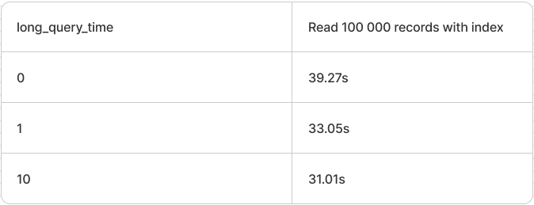
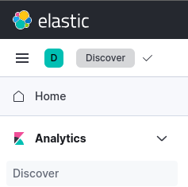
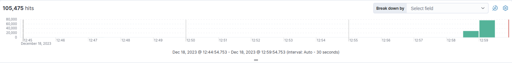

# ELK MySQL slow logs.

To start application run the simple command:

```bash
docker-compose up
```

It will run the applications:

  * [Mariadb with filebeat in container](http://localhost:3306/) on port `3306`
    * user: hsa1016
    * password: cfltcznmiscnyflwznm0
  * [Elasticsearch](http://localhost:9200/) on port `9200`
    * user: NO
    * password: NO
  * [Kibana](http://localhost:5601/) on port `5601`
    * user: NO
    * password: NO
  * [Logstash](http://localhost:5044/) on port `5044`
    * user: NO
    * password: NO

## Perfomance



## Kibana

Get into [Analytics/Discover](http://localhost:5601/app/discover#/) section 



You can see there some statistic about your queries.



Slow queries are sent and can be displayed in this way:


## Logstash

Logstash pipeline config:

```bash
- pipeline.id: hsa1016-mariadb-slow-log
  path.config: "/usr/share/logstash/pipeline/slow-log.conf"
  pipeline.workers: 2
  queue.type: persisted
```

Logstash slow-log.conf

```bash
# The # character at the beginning of a line indicates a comment. 
# Use comments to describe your configuration.

input {
  beats {
    port => "5044"
  }
}

# The filter part of this file is commented out to indicate that it is optional.
filter {
}

output {
  elasticsearch {
    hosts => [ "hsa1016-elasticsearch:9200" ]
  }
}
```

## Filebeat

Main filebeat config:

```bash
filebeat.config.modules:
  path: /etc/filebeat/modules.d/*.yml
filebeat.inputs:
  - type: filestream
    id: hsa1016-mariadb-slow-log
    paths:
      - /var/log/mysql/mariadb-slow.log
    parsers:
      - multiline:
          type: pattern
          pattern: '^# User@Host'
          negate: true
          match: after
output.logstash:
  hosts:
    - 'hsa1016-logstash:5044'
```

Filebeat logstash module config:

```bash
# Module: logstash
# Docs: https://www.elastic.co/guide/en/beats/filebeat/8.10/filebeat-module-logstash.html

- module: logstash
  # logs
  log:
    enabled: true

    # Set custom paths for the log files. If left empty,
    # Filebeat will choose the paths depending on your OS.
    #var.paths:

  # Slow logs
  slowlog:
    enabled: false
    # Set custom paths for the log files. If left empty,
    # Filebeat will choose the paths depending on your OS.
    #var.paths:
```

## Mariadb

Slow query conf:

```bash
[mysqld]
slow_query_log=1
slow_query_log_file=/var/log/mysql/mariadb-slow.log
```